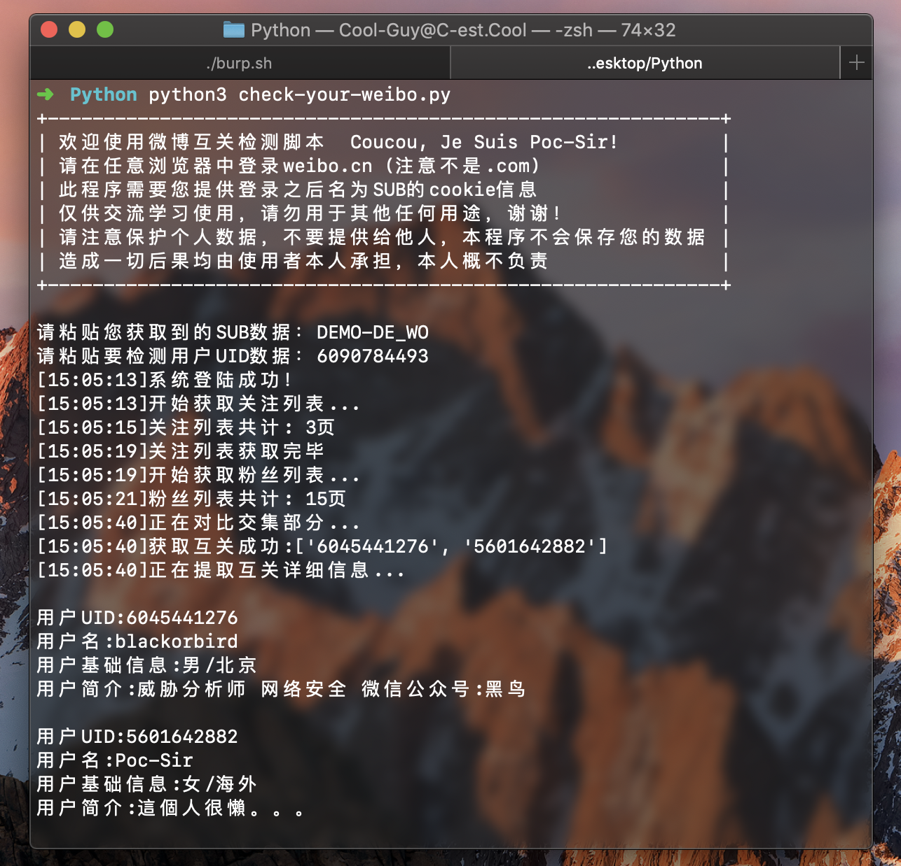
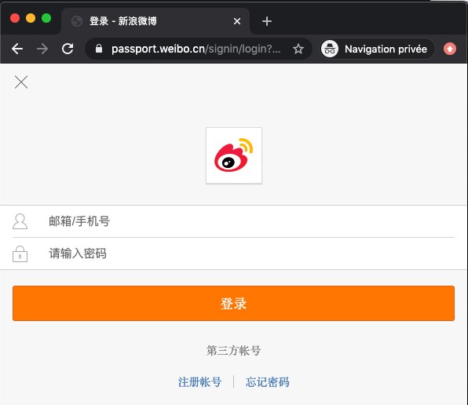
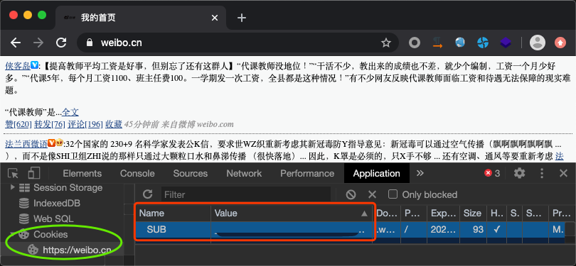

# 微博互关检测脚本

本脚本作者：Poc-Sir，兼容Python3.X环境，需安装requests库：
`pip3 install requests`

> 此脚本仅供学习交流使用，由于传播、利用此脚本而造成的任何直接或者间接的后果及损失，均由使用者本人负责，本作者不为此承担任何责任。请在使用时遵循相关法律法规以及微博使用条款，谢谢！

本脚本需用户在“weibo.cn”（彩版）中登录，注意不是“weibo.com”：

并向脚本提供登陆之后Cookie中的SUB数据内容：

注意⚠️：请注意保管好自己的隐私信息，不要将cookies信息泄露给他人，本程序不会保存您的任何个人信息，本人亦不会向您索要任何身份凭证。
